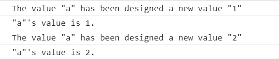
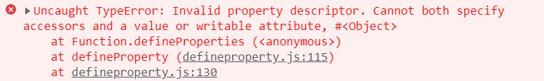

# Object.definePropery 学习
> Object.defineProperty()  定义属性的方法

*definition (定义)   Property (属性)*

## 参数解析
1. Object.defineProperty(obj, prop, descriptor)
   - obj 对象
   - prop 属性
   - descriptor 描述项集合(配置集合)

2. Object.defineProperties(obj, {

   ​	prop: descriptor,

   ​	prop: descriptor

   ​	......

   })

   - 为对方设置多个属性值


## descriptor

### 属性值解析

- value 属性默认值
- writable 默认为 false     标识属性值不可修改
  - 英文释意：write写 writable可写 written已写入
- enumerable 默认为 false    标识属性值不可枚举
  - 英文释意： enum枚举  enumerable可枚举
- configurable 默认为 false     标识可否操作
  - configure配置 configurable可配置
- get 属性的 getter 函数，访问属性是调用此函数，不存在时默认undefined
- set 属性的 setter 函数， 属性值被修改时会调用此函数，该方法接受一个参数 （新值） 不存在时默认为undefined

*注意：value 和  writerable 出现任意一与 get和 set 任一个不能同时设置*


### 属性值详情

1. **value**

   ```javascript
   function defineproperty() {
       var _obj = {};
       
       Object.defineProperty(_obj, 'a', {
   		value: 1  // 默认值
   	 }) 
       return _obj;
   }
   
   var obj = defineproperty();
   console.log(obj);	// 输出 {a； 1}
   obj.a = 5;	// 尝试修改
   console.log(obj);	// 输出 {a； 1}
   
   for(var key in obj) {
   	console.log(key + ':' + obj[key]);	// 无法打印
   }
   
   delete obj.a;
   console.log(obj);	// 输出 {a； 1}
   ```

   在调用 Object.defineProperty 为 _obj 添加了一个 a 属性并设置默认值为 1

   并且这个值是无法修改的、不可枚举、无法删除

   

2. writen、enumerable、configurable

   ```javascript
   function defineproperty() {
     var _obj = {};
     
     Object.defineProperties(_obj, {
       a: {
         value: 1,
         // writable 默认false 不可修改  设置为 true 时可重新写入
         writable: true,
         // enumerable 默认false 不可枚举  设置为 true 时可枚举遍历
         enumerable: true,
         // configurable 默认false 不可操作  设置为 true 可操作可配置
         configurable: true
       },
       b: {
         value: 2
       },
     })
   
     return _obj;
   }
   
   var obj = defineproperty();
   obj.a = 5;	// a 已设置 writable 为 true
   obj.b = 6;	// b 默认 false
   console.log(obj);	// 输出 {a: 5, b: 6}
   
   for(var k in obj) {		//	a 设置 enumerable 为 true, b 默认为 false
     console.log(k + ':' + obj[k]);	// 输出 a:5， b没有被打印 
   }
   
   delete obj.a;	// a 已设置 configurable 为 true
   delete obj.b;	// b 默认 false
   console.log(obj);	// 输出 {b: 2}
   ```

   

 3. get & set

    ```javascript
    function defineProperty() {
      var _obj = {};
      var a = 1; // 定义局部变量用来控制数据
    
      /**
       * 每一个属性定义的时候都会产生一个 getter 和 setter 机制
       * getter 和 setter 本身就存在
       * 
       */
      Object.defineProperties(_obj, {
        a: {
          // value 和 writerable 出现任意一与 get 和 set 任一个不能同时设置
          // 使用 get 和 set 时已经在操作对象了，所以 value 和 writerable 没有意义
          // 当访问对象属性时，会调用 get 方法
          get() {
          	// get 中可以改变返回值    
            return '"a"\'s value is ' + a + '.';
          },
          // 为对象赋值时会执行 set 方法
          // newVal 新值
          set(newVal) {
            a = newVal;
            console.log('The value "a" has been designed a new value "' + newVal + '"');
          }
        },
        b: {
    		// 为了表示 b 也可以进行单独设置
        }
      })
      return _obj;
}
    
    var obj = defineProperty()
    obj.a = 1;	// 首先执行 set 中的语句，为对象赋值
    console.log(obj.a)	// 输出时会输出 get 方法的返回值 这里使用局部变量 a 来数据劫持
    obj.a = 2;
    console.log(obj.a)
    ```
    
    执行结果如下:
    
    ​	
    
    在访问 obj.a  时并没有直接输出 '1' 或者 '2' 而是输出了 get 中设置的语句
    
    

使用 defineproperty 的 get 和 set 请求可以在数据在设置或者取值时进行操作(如上述代码)，利用此特性可以进行 **数据劫持**

- 数据劫持： 对待对象取值和设置有一定的配置或阻止方法


4. value/writale 与 get/set 互斥

   ```javascript
   function defineProperty() {
       var _obj = {};
       
       Object.defineProperties(_obj, {
         a: {
           value: 1,
           writable: false,
           get() {
           },
           set(newVal) {
             console.log('The value "a" has been designed a new value "' + newVal + '"');
           }
         }
       })
       return _obj;
     }
     
     var obj = defineProperty();
     obj.a = 1;
     console.log(obj.a);
   ```

   报错信息：

   ​	类型错误: 属性描述符无效。不能同时指定访问器 (get 或 set) 和值 (value) 或可写属性 (writable)

   ​	


## 知识联想

​	Vue 的**双向数据绑定**就是利用 Object.defineproperty  中的 getter 和 setter 进行数据劫持从而达到数据变化到视图更新的效果。


【😊 转载请注明出处链接】